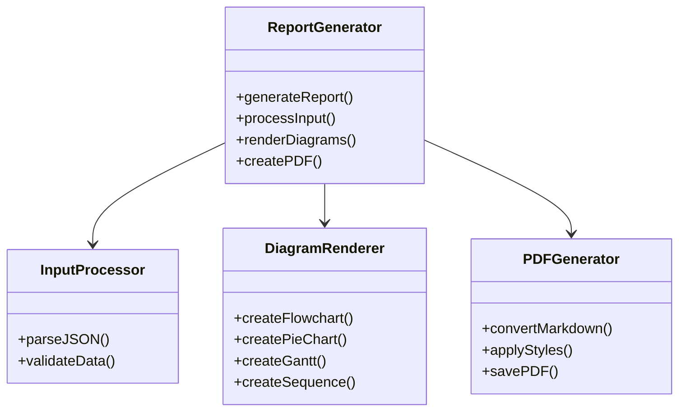
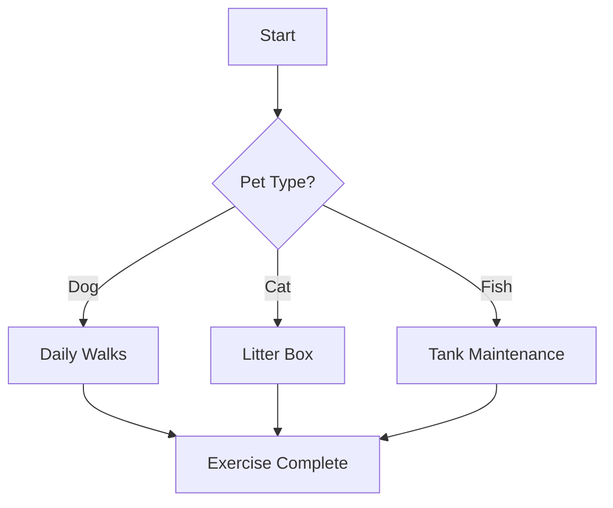
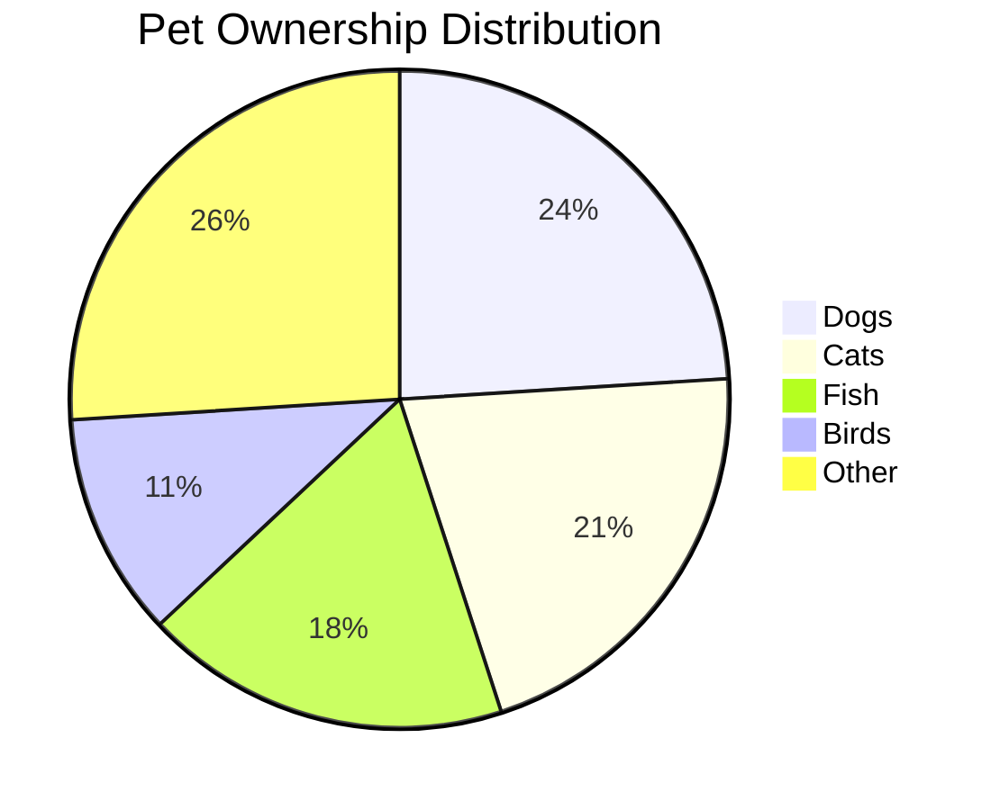
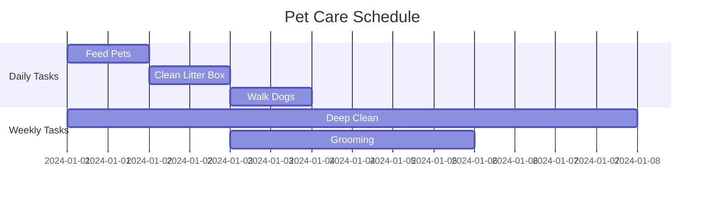
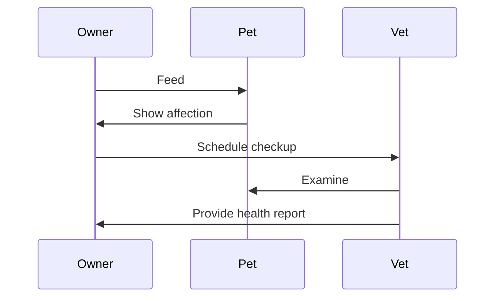

# Report Generator

A Node.js program that generates reports with Mermaid diagrams from JSON input.

## Features

- Converts JSON data into formatted Markdown reports
- Generates multiple types of Mermaid diagrams
- Supports PDF output
- Handles complex data relationships

## Architecture



## Example Diagrams

### Flow Charts



### Pie Charts



### Gantt Charts



### Sequence Diagrams



## Usage

1. Install dependencies:
```bash
npm install
```

2. Create your input JSON file:
```json
{
  "title": "Pet Report",
  "data": {
    "pets": [
      {
        "type": "Dog",
        "count": 24
      },
      {
        "type": "Cat",
        "count": 21
      }
    ]
  }
}
```

3. Run the generator:
```bash
npm run generate
```

## Customization

You can customize the report by:
- Modifying the input JSON structure
- Editing the Markdown templates
- Adjusting the Mermaid diagram styles
- Configuring PDF output settings

## Contributing

Contributions welcome! Please read the contributing guidelines first.

## License

MIT
